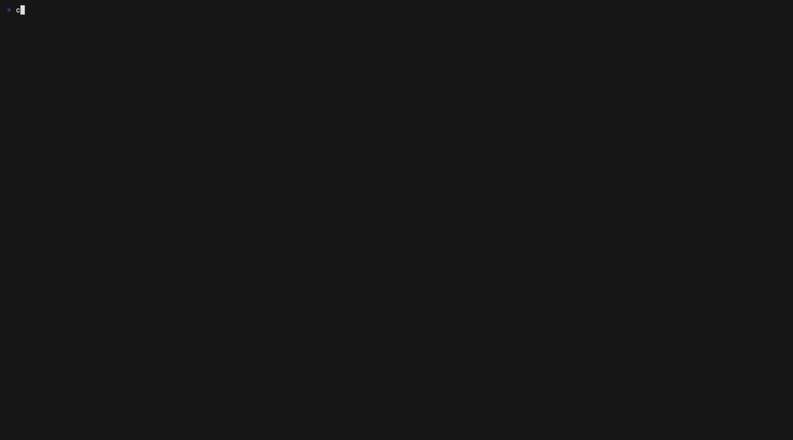
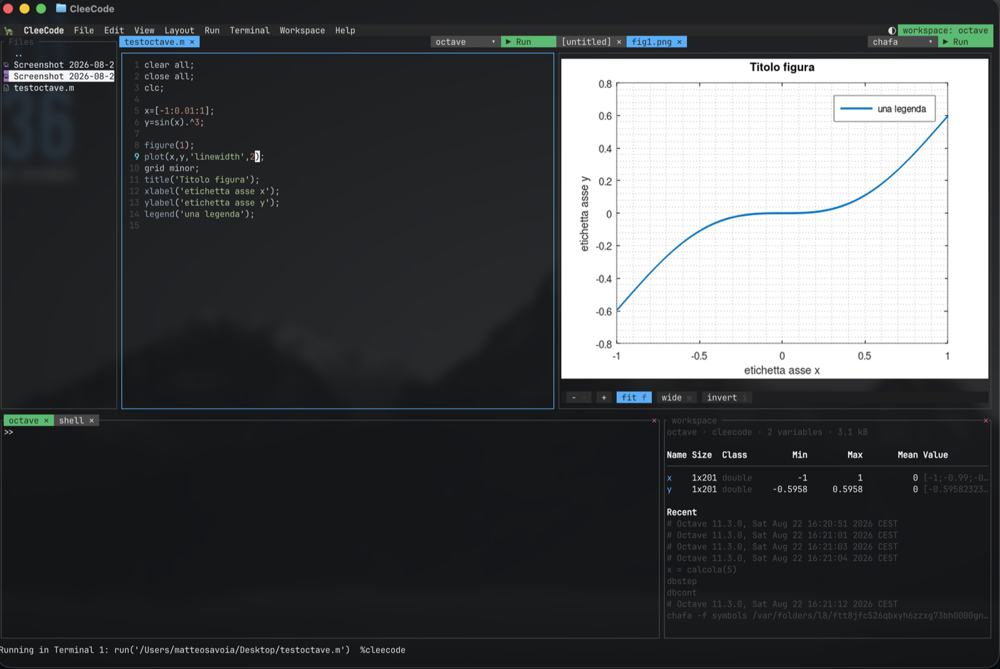
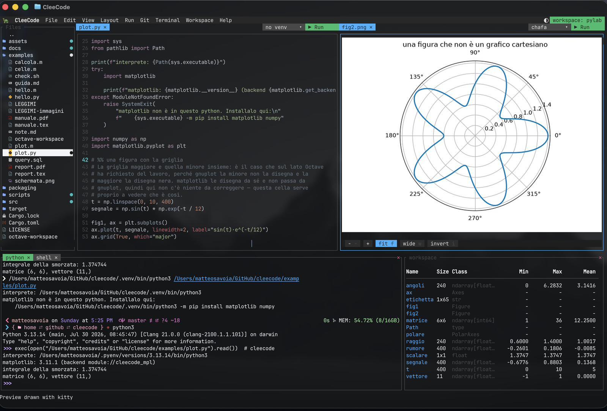
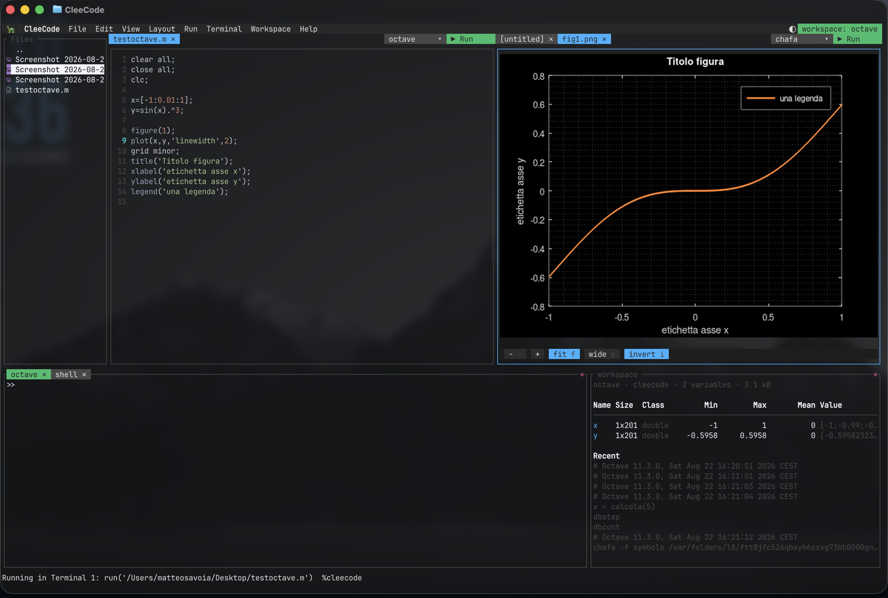

# CleeCode 🐢

An editor, a file tree and real terminals in one window. Written in Rust, driven from the
keyboard, with the mouse as an alternative rather than the only way.

Best in a terminal that can draw pictures — **Ghostty**, **kitty**, **WezTerm** or **iTerm2** —
where pictures, PDFs and Markdown are shown as themselves rather than as coloured blocks. It
works anywhere; those are where it looks like the screenshots.

By **Matteo Savoia** ([msavox](https://github.com/msavox)).



## Installing

### macOS and Linux — Homebrew

```bash
brew tap msavox/clee
brew trust msavox/clee
brew install clee
```

`brew trust` exists from Homebrew 6 onwards, and there it is required rather than a formality:
a formula is Ruby code Homebrew executes locally, so it refuses to load one from a third-party
tap until you trust the source — tapping alone doesn't grant that. Without it you get `Refusing
to load formula msavox/clee/clee from untrusted tap`. On older Homebrew the command does not
exist (`Unknown command: brew trust`) and is not needed: skip it and install.

If `brew tap` itself fails with `git@github.com: Permission denied (publickey)`, that is not
about this tap — a global git rule is rewriting HTTPS URLs to SSH and you have no key on that
machine. `git config --global --get-regexp 'url\..*\.insteadof'` shows it.

The formula builds from source (well under a minute on macOS; longer on Linux, where it also
pulls `libxcb`). [Homebrew on Linux](https://docs.brew.sh/Homebrew-on-Linux) uses the same tap
and CI verifies that install on Ubuntu, but only the *install* is tested.

### Prebuilt binaries

macOS arm64/x86_64, Linux arm64/x86_64 and Windows x86_64 builds are attached to each
[release](https://github.com/msavox/cleecode/releases). Outside macOS they're experimental: CI
checks they start, nothing more. Each is built on the architecture it names — the arm64 Linux
one covers an Ampere or Graviton server and a 64-bit Raspberry Pi OS. The Linux binaries need
glibc and libxcb — install `libxcb1` (Debian/Ubuntu) or `libxcb` (Fedora/Arch) if one fails to
start. For Alpine/musl, build from source.

### Optional extras

Previews reach for a few outside tools. None is required — without them CleeCode shows less
rather than failing, and says so in the tab instead of leaving it blank.

```bash
brew install poppler        # PDF pages (ghostscript works too)
brew install pandoc typst   # Markdown as a real document, pictures and all
brew install chafa          # a picture inside a terminal pane
```

Without a graphics-capable terminal (see the top of this file), pictures fall back to coloured
half-blocks and Markdown to styled terminal text — less to look at, nothing missing.

They are looked for where they are installed, not only on the `PATH`: an editor opened from the
Dock inherits macOS's own environment rather than a shell's, and Homebrew and `/Library/TeX/texbin`
are not in it.

### From source

Needs a [Rust toolchain](https://rustup.rs) 1.85+ (edition 2024). On Linux the clipboard also
needs the X11/xcb headers; on Windows, the MSVC toolchain plus *Desktop development with C++*.

```bash
# Debian/Ubuntu
sudo apt install build-essential pkg-config libxcb1-dev libxcb-render0-dev libxcb-shape0-dev libxcb-xfixes0-dev
# Fedora
sudo dnf install gcc pkgconf-pkg-config libxcb-devel
# Arch
sudo pacman -S base-devel libxcb

cargo install --locked --git https://github.com/msavox/cleecode
```

That puts `clee` in `~/.cargo/bin` (`%USERPROFILE%\.cargo\bin`), so make sure it's on your
`PATH`.

### From a clone

```bash
cargo build --release
./target/release/clee              # the last project, its open files and your layout
./target/release/clee src/main.rs  # current directory, with a file pre-opened
./target/release/clee ./some-dir   # that directory as the project root
./target/release/clee -w work      # open the saved workspace called "work"
./target/release/clee -w           # list the saved workspaces
./target/release/clee -e notes.md  # just that file, everything else hidden
./target/release/clee --help       # usage, --version, --install-font, --install-app
```

An argument skips the startup splash; the splash only shows on a bare `clee` or with `-w`,
where it names the workspace being opened.

### Nerd Font icons

The file tree's icons need a [Nerd Font](https://www.nerdfonts.com/). CleeCode bundles
JetBrainsMono Nerd Font Mono and can install it:

```bash
./target/release/clee --install-font
```

It copies the font into your per-user font directory (`~/Library/Fonts`,
`~/.local/share/fonts`, or `%LOCALAPPDATA%\Microsoft\Windows\Fonts`), points Ghostty at it if
present on macOS/Linux, and registers it on Windows. Restart your terminal afterwards — or
just point your terminal at a Nerd Font you already have.

### In the Dock (macOS)

CleeCode is a terminal application, but it can have an icon like any other editor:

```bash
clee --install-app
```

That builds `CleeCode.app` in `/Applications` (or `~/Applications`, if the first is not
writable) and registers it. Clicking it opens the project you were last in; dropping a file
or a folder on it — or picking CleeCode under *Open with* in Finder's Get Info — opens that,
with its folder as the project root. To keep it in the Dock, open it once and choose
*Options ▸ Keep in Dock*; to uninstall, drag the app to the Bin.

The launcher needs [Ghostty](https://ghostty.org) (`brew install --cask ghostty`) to host
the editor, and asks for a new window in the Ghostty already running rather than starting a
second one — which is automation, so macOS asks for permission the first time. Refusing it
costs only that: the launcher falls back to opening a separate Ghostty instance.

The bundle is built on your machine rather than downloaded, which is what keeps it free of
Gatekeeper warnings: nothing arrives quarantined, so nothing needs an Apple Developer
signature to open. It has the path to `clee` compiled into it, so re-run the command after
moving or reinstalling the binary.

## What it does

An editor with 200-odd languages highlighted, real terminals in the same window, previews for
pictures, PDFs and Markdown, and Octave and Python as a live numeric session.


**Editing.** Multi-file tabs, a split editor, find and replace with regular expressions,
project-wide search, code folding, column selection, and a git panel that stages, commits and
switches branch. Words already in your buffers are offered as you type — along with what a
language server suggests, where one is installed, and its errors underlined where they are.

**Terminals that are real.** Tiled shells that survive the editor's own mistakes, each with a
name and a startup command. Save the whole set-up — root, files, frames, shells — as a named
workspace and open it with `clee -w NAME`.

**Previews.** A `.png` opens as pixels, a PDF as pages that re-render when you typeset them, a
Markdown file as a document beside its source.

**Octave and Python, as an IDE.** `clee -w octave` or `clee -w pylab` opens the interpreter with
a second window beside it showing what the session holds — filling in by itself, with nothing
typed at your prompt to ask. Send a cell to the running session, get plots as tabs, look inside a
variable, set a breakpoint and stop in it.



*One window: the script on the left, `figure(1)` arriving as the `fig1.png` tab, the Octave
prompt below it and the workspace panel beside — `x` and `y` with their size, class and range,
listed without asking.*



*The same arrangement in Python. `▶ Run` on `plot.py` did not start a fresh interpreter: it typed
`exec(open(...).read())` at the prompt that was already there, so the session kept everything the
file made — which is what the panel on the right is listing, `ndarray` shapes and ranges and all,
and what lets the next line you type carry on from where the script left off.*



*The same figure with `i`: Octave draws on white, the tab inverts it, and the plot belongs to
the theme around it rather than glowing in the middle of it.*


*Stopped inside `calcola`: the line is marked, and the panel shows `a` and `n` — the function's
own locals, not the session's variables.*

**It does not close on you.** CleeCode hosts long-running shells, so an internal failure is
contained and reported in the status line rather than ending the process. A broken terminal
costs you that terminal, at most.

## More

  · **[The whole tour](docs/features.md)** — every feature, with the screenshots
  · **[The numeric side](docs/numeric.md)** — Octave and Python, start to finish
  · **The built-in manual** — `Ctrl+Shift+M`, or `man clee`. It ships in the binary, so it is
    always the version you are running.


## Requirements

**macOS** is the supported platform — where CleeCode is developed, tested and released.
**Linux and Windows** are written for throughout (paths, clipboard, shell, fonts, venvs) and
compile in CI, where the binary is also started to confirm it links and launches. Beyond that
nobody has used the editor there, so those builds are experimental and bug reports are welcome.

Built on [ratatui](https://github.com/ratatui/ratatui)/[crossterm](https://github.com/crossterm-rs/crossterm),
with [arboard](https://github.com/1Password/arboard) for the clipboard,
[sysinfo](https://github.com/GuillaumeGomez/sysinfo) for the process inspection behind Run and
`scp`-on-drop, and [dirs](https://github.com/dirs-dev/directories-rs) for config and font paths.
Terminal panes launch `$SHELL` (falling back to `/bin/bash`) on Unix and `%ComSpec%` on Windows.

## Status

Personal project, actively evolving.

## License

[MIT](LICENSE). The bundled font (`assets/fonts/`) is a Nerd Font-patched build of JetBrains
Mono under the [SIL Open Font License 1.1](assets/fonts/OFL.txt) and keeps its own terms. The
syntax definitions compiled into the binary come from
[two-face](https://github.com/CosmicHorrorDev/two-face), which collects bat's grammars: each
keeps the licence it was published under (MIT or Apache-2.0 in almost every case), listed in
full by `two_face::acknowledgement::listing()` and in that project's `generated/` directory.
