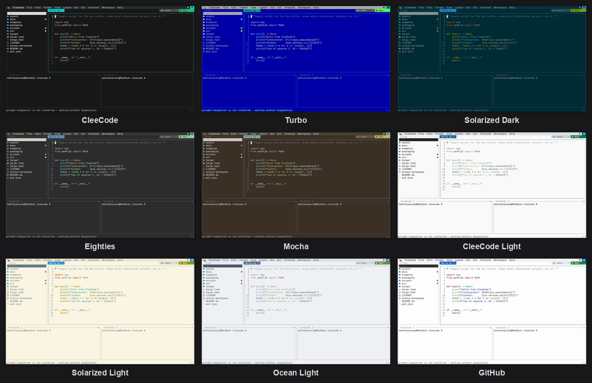

# CleeCode 🐢

An editor, a file tree and real terminals in one window. Written in Rust, driven from the
keyboard, with the mouse as an alternative rather than the only way.

By **Matteo Savoia** ([msavox](https://github.com/msavox)) ·
**[cleecode.marunja.com](https://cleecode.marunja.com)**


*Six beats, one feature each: it starts, it runs your code, it renders your documents, it
knows the repository's history, it changes its skin in one keypress, and it splits.*

## Your coding agent, inside the editor

`Ctrl+Shift+A` opens the agent drawer beside whatever you were doing. Empty, it is the
launcher — claude, codex, opencode, gemini, drawn large, arrows and Enter to start one, the
ones you do not have shown anyway and dimmed. The agent is the TUI you already have, on the
subscription you already pay for: CleeCode holds no API key and rebuilds no chat. Subscription
login and API keys both work, because the editor is agnostic by construction — the agent in
the pane is the real CLI and authenticates itself; CleeCode never asks for, stores, or sees a
credential of any kind.


*The drawer, a real claude, one prompt — and the edit landing live in the buffer, the changed
lines lit until you take the keyboard back.*

Press `Ctrl+Shift+A` again with an agent running and CleeCode writes where you are at its
prompt — selection, diagnostic or cursor line, as `path:line` — and never presses Enter for
you. The files the agent rewrites reload on their own, the new lines lit in the gutter; a
buffer with your unsaved edits never reloads itself, because your work wins over the agent's,
always. Follow mode (*View → Follow edits made outside*, off until you ask) opens the files
you did not have open beside your work, without ever taking the keyboard.

And the editor answers back. `clee --mcp` makes it an MCP server with seven tools: the open
files (unsaved ones flagged), the selection, the diagnostics, `open_file` with a line range
the editor highlights, `preview` for rendering a file beside your work, `say` for one line in
the status bar — and `edit_buffer`, which changes an unsaved buffer only after asking you, on
your terms (`once`, `always this session`, or `no`). **An agent started from the drawer gets
all of it with zero configuration.** Any other agent takes one line. Claude Code:

```
claude mcp add clee -- clee --mcp
```

codex, in `~/.codex/config.toml`:

```toml
[mcp_servers.clee]
command = "clee"
args = ["--mcp"]
```

opencode, in `~/.config/opencode/opencode.json`:

```json
{ "mcp": { "clee": { "type": "local", "command": ["clee", "--mcp"], "enabled": true } } }
```

gemini, in `~/.gemini/settings.json`:

```json
{ "mcpServers": { "clee": { "command": "clee", "args": ["--mcp"] } } }
```

Then start the agent inside a CleeCode terminal: the wiring works by inheritance, so an agent
started anywhere else is told it is not in a session rather than handed a wrong answer.

## Installing

### macOS and Linux — Homebrew

```bash
brew tap msavox/clee
brew trust msavox/clee
brew install clee
```

`brew trust` exists from Homebrew 6 onwards, where it is required rather than a formality; on
older Homebrew the command does not exist and is not needed — skip it and install. The formula
builds from source: well under a minute on macOS, longer on Linux, where it also pulls
`libxcb`.

<details>
<summary>If <code>brew tap</code> or <code>brew install</code> refuses…</summary>

`Refusing to load formula msavox/clee/clee from untrusted tap` means Homebrew 6 without the
`brew trust` line: a formula is Ruby code Homebrew executes locally, so it refuses to load one
from a third-party tap until you trust the source — tapping alone doesn't grant that.

`git@github.com: Permission denied (publickey)` on the tap is not about this tap — a global
git rule is rewriting HTTPS URLs to SSH and you have no key on that machine.
`git config --global --get-regexp 'url\..*\.insteadof'` shows it.

[Homebrew on Linux](https://docs.brew.sh/Homebrew-on-Linux) uses the same tap and CI verifies
that install on Ubuntu, but only the *install* is tested.
</details>

### Windows — Scoop

```powershell
scoop bucket add clee https://github.com/msavox/scoop-clee
scoop install clee
```

### Prebuilt binaries

macOS arm64/x86_64, Linux arm64/x86_64 and Windows x86_64 builds are attached to each
[release](https://github.com/msavox/cleecode/releases), each built on the architecture it
names — the arm64 Linux one covers an Ampere or Graviton server and a 64-bit Raspberry Pi OS.
The Linux binaries need glibc and libxcb — install `libxcb1` (Debian/Ubuntu) or `libxcb`
(Fedora/Arch) if one fails to start. For Alpine/musl, build from source.

### Optional extras

Previews reach for a few outside tools. None is required — without them CleeCode shows less
rather than failing, and says so in the tab instead of leaving it blank.

```bash
brew install poppler        # PDF pages (ghostscript works too)
brew install pandoc typst   # Markdown as a real document, pictures and all
brew install chafa          # a picture inside a terminal pane
```

Best in a terminal that can draw pictures — **Ghostty**, **kitty**, **WezTerm** or
**iTerm2** — where pictures, PDFs and Markdown are shown as themselves rather than as
coloured blocks. It works anywhere; those are where it looks like the screenshots. The tools
are looked for where they are installed, not only on the `PATH`: an editor opened from the
Dock inherits macOS's own environment rather than a shell's, and Homebrew and
`/Library/TeX/texbin` are not in it.

### From source

Needs a [Rust toolchain](https://rustup.rs) 1.85+ (edition 2024). On Linux the clipboard also
needs the X11/xcb headers; on Windows, the MSVC toolchain plus *Desktop development with C++*.

```bash
# Debian/Ubuntu
sudo apt install build-essential pkg-config libxcb1-dev libxcb-render0-dev libxcb-shape0-dev libxcb-xfixes0-dev
# Fedora
sudo dnf install gcc pkgconf-pkg-config libxcb-devel
# Arch
sudo pacman -S base-devel libxcb

cargo install --locked --git https://github.com/msavox/cleecode
```

That puts `clee` in `~/.cargo/bin` (`%USERPROFILE%\.cargo\bin`), so make sure it's on your
`PATH`.

### From a clone

```bash
cargo build --release
./target/release/clee              # the last project, its open files and your layout
./target/release/clee src/main.rs  # current directory, with a file pre-opened
./target/release/clee ./some-dir   # that directory as the project root
./target/release/clee -w work      # open the saved workspace called "work"
./target/release/clee -w           # list the saved workspaces
./target/release/clee -e notes.md  # just that file, everything else hidden
./target/release/clee --help       # usage, --version, --install-font, --install-app
```

An argument skips the startup splash; the splash only shows on a bare `clee` or with `-w`,
where it names the workspace being opened. *Splash screen at startup* in the settings
(`Ctrl+Shift+O`) turns it off for good, for the bare `clee` too.

### Nerd Font icons

The file tree's icons need a [Nerd Font](https://www.nerdfonts.com/). CleeCode bundles
JetBrainsMono Nerd Font Mono and can install it:

```bash
./target/release/clee --install-font
```

It copies the font into your per-user font directory (`~/Library/Fonts`,
`~/.local/share/fonts`, or `%LOCALAPPDATA%\Microsoft\Windows\Fonts`), points Ghostty at it if
present on macOS/Linux, and registers it on Windows. Restart your terminal afterwards — or
just point your terminal at a Nerd Font you already have.

### In the Dock (macOS)

CleeCode is a terminal application, but it can have an icon like any other editor:

```bash
clee --install-app
```

That builds `CleeCode.app` in `/Applications` (or `~/Applications`, if the first is not
writable) and registers it. Clicking it opens the project you were last in; dropping a file
or a folder on it — or picking CleeCode under *Open with* in Finder's Get Info — opens that,
with its folder as the project root. To keep it in the Dock, open it once and choose
*Options ▸ Keep in Dock*; to uninstall, drag the app to the Bin.

<details>
<summary>What the launcher needs, and why the bundle is built on your machine</summary>

The launcher needs [Ghostty](https://ghostty.org) (`brew install --cask ghostty`) to host
the editor, and asks for a new window in the Ghostty already running rather than starting a
second one — which is automation, so macOS asks for permission the first time. Refusing it
costs only that: the launcher falls back to opening a separate Ghostty instance. That window
is the editor's, so it asks for `wait-after-command` to be off and closes when you quit,
whatever your own Ghostty config says — no "Process exited. Press any key" left behind.

The bundle is built on your machine rather than downloaded, which is what keeps it free of
Gatekeeper warnings: nothing arrives quarantined, so nothing needs an Apple Developer
signature to open. The launcher is compiled into it, path to `clee` and all, so re-run the
command after moving or reinstalling the binary — and to pick up any change to the launcher
itself that came with a new version.
</details>

## What it does

An editor with 200-odd languages highlighted, real terminals in the same window, previews for
pictures, PDFs and Markdown, and Octave and Python as a live numeric session.


**Editing.** Multi-file tabs, a split editor, find and replace with regular expressions,
project-wide search, code folding, column selection, and a git panel that stages, commits and
switches branch. Words already in your buffers are offered as you type — along with what a
language server suggests, where one is installed, and its errors underlined where they are.
The commands you reach for every hour are all there: go to definition and back, every use of
a name, the file's symbols, format as one undo, code actions on the diagnostic under the
cursor, and a rename that shows you the diff before touching anything. Over a Markdown file,
a one-row formatting bar: bold, headings, lists, links as buttons that toggle the syntax
around your selection — each showing the characters it writes, so the bar teaches you not to
need it, and View hides it once it has.

**Terminals that are real.** Tiled shells that survive the editor's own mistakes, each with a
name and a startup command. Save the whole set-up — root, files, frames, shells — as a named
workspace and open it with `clee -w NAME`. Double-click a row of output to go where it points:
a `path:line` opens in the editor at that line, a `https://…` opens in the browser. Four
workspaces ship built in and need no file of their own: the default layout, `octave` and `pylab`
below, and `minimal` — no sidebar, no terminal, no menu bar, just the editor.

**Previews.** A `.png` opens as pixels, a PDF as pages that re-render when you typeset them, a
Markdown file as a document beside its source. When a file wants a real application instead,
right-click it in the tree: *Open outside CleeCode* hands it to whatever the desktop opens that
kind with.

**Octave and Python, as an IDE.** `clee -w octave` or `clee -w pylab` opens the interpreter with
a second window beside it showing what the session holds — filling in by itself, with nothing
typed at your prompt to ask. Send a cell to the running session, get plots as tabs, look inside a
variable, set a breakpoint and stop in it.


*One window: the script on the left, `figure(1)` arriving as the `fig1.png` tab, the Octave
prompt below it and the workspace panel beside — `x` and `y` with their size, class and range,
listed without asking.*


*The same arrangement in Python. `▶ Run` on `plot.py` did not start a fresh interpreter: it typed
`exec(open(...).read())` at the prompt that was already there, so the session kept everything the
file made — which is what the panel on the right is listing, `ndarray` shapes and ranges and all,
and what lets the next line you type carry on from where the script left off.*


*The same figure with `i`: Octave draws on white, the tab inverts it, and the plot belongs to
the theme around it rather than glowing in the middle of it.*


*Stopped inside `calcola`: the line is marked, and the panel shows `a` and `n` — the function's
own locals, not the session's variables.*

**And a debugger for compiled programs.** C, C++, Rust — anything your machine builds with symbols
in it. *Debug ▸ Start debugging* asks which program to run, with the guess already in the box, and
runs it under whichever debug adapter you have: `lldb-dap`, or a `gdb` 14 or newer, which speaks
the protocol natively. There is one set of breakpoints — the same `Ctrl+Shift+P` in the same
gutter, in any file now — and stopping marks the line and opens a panel with the stack, the
frame's variables and your watch expressions, where `c`, `n`, `s` and `o` do what gdb taught
your fingers they do.

**Nine themes, five dark and four light.** The button beside the background toggle on the menu
bar opens the list, or *View → Theme…* if your hands are on the keyboard. The choice is written
out at once, because the reason to reach for it is usually that the screen has become hard to
read, and having to make it again next session would be its own small misery.



*Turbo is the blue screen, for anyone who learned to program on one: a light bar over a dark
field, and the initial of each menu entry in red. The four light ones paint their own surface —
they have to, or their dark text lands on whatever your terminal's background is. The dark ones
paint theirs too, so the theme you chose is the theme you get; a translucent terminal comes
back with one switch, View → Transparent background.*

**It does not close on you.** CleeCode hosts long-running shells, so an internal failure is
contained and reported in the status line rather than ending the process. A broken terminal
costs you that terminal, at most — and against what no shield stops, `kill -9` included, your
dirty buffers are copied to a recovery folder every few seconds and offered back at the next
start.

## More

  · **[The whole tour](docs/features.md)** — every feature, with the screenshots
  · **[The numeric side](docs/numeric.md)** — Octave and Python, start to finish
  · **The built-in manual** — `Ctrl+Shift+M`, or `man clee`. It ships in the binary, so it is
    always the version you are running.


## Requirements

**macOS** is the supported platform — where CleeCode is developed, tested and released.
**Linux and Windows** are written for throughout (paths, clipboard, shell, fonts, venvs) and
compile in CI, where the binary is also started to confirm it links and launches. Beyond that
nobody has used the editor there, so those builds are experimental and bug reports are welcome.

Built on [ratatui](https://github.com/ratatui/ratatui)/[crossterm](https://github.com/crossterm-rs/crossterm),
with [arboard](https://github.com/1Password/arboard) for the clipboard,
[sysinfo](https://github.com/GuillaumeGomez/sysinfo) for the process inspection behind Run and
`scp`-on-drop, and [dirs](https://github.com/dirs-dev/directories-rs) for config and font paths.
Terminal panes launch `$SHELL` (falling back to `/bin/bash`) on Unix and `%ComSpec%` on Windows.

## Status

Personal project, actively evolving. If it earns a place in your day,
[a coffee](https://ko-fi.com/msavox) ☕ is a kind way to say so — there is a little cup at the
right end of the menu bar too.

## License

[MIT](LICENSE). The bundled font (`assets/fonts/`) is a Nerd Font-patched build of JetBrains
Mono under the [SIL Open Font License 1.1](assets/fonts/OFL.txt) and keeps its own terms. The
syntax definitions compiled into the binary come from
[two-face](https://github.com/CosmicHorrorDev/two-face), which collects bat's grammars: each
keeps the licence it was published under (MIT or Apache-2.0 in almost every case), listed in
full by `two_face::acknowledgement::listing()` and in that project's `generated/` directory.
