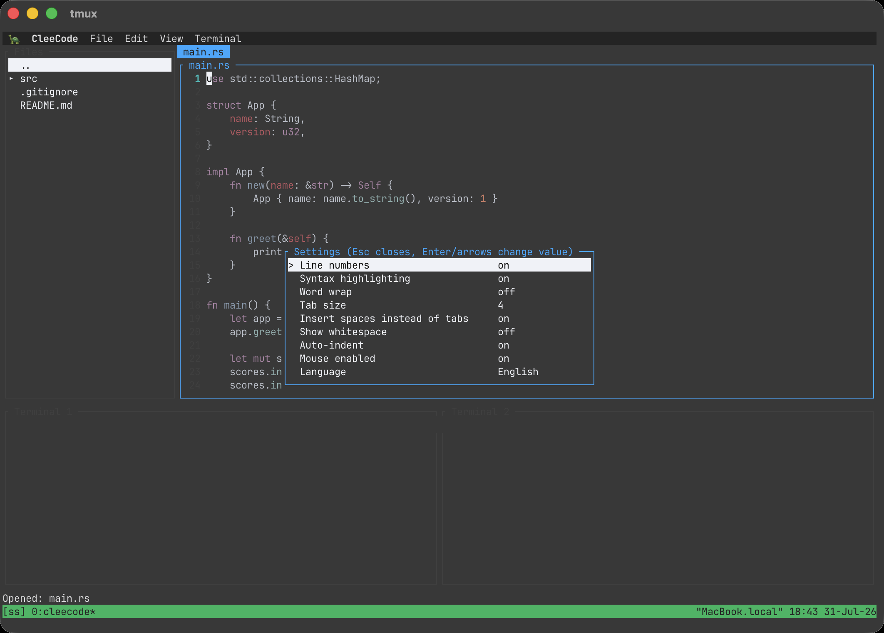

# CleeCode 🐢

A terminal IDE written in Rust: a `micro`-style editor with a file tree sidebar,
integrated terminals, syntax highlighting, and a classic drop-down menu bar —
all inside your terminal.


## Features

- **Editor** — syntax highlighting (via [syntect](https://github.com/trevorfulton/syntect)) for all major languages, line numbers, multi-file tabs, text selection, copy/cut/paste with the real system clipboard, indent/outdent, auto-indent, word wrap, whitespace display
- **File tree sidebar** — navigate with arrows, expand/collapse with `→`/`←`, `Enter` on a folder makes it the new tree root, `..` walks back up, `Delete` asks for confirmation before removing a file
- **Multiple terminals** — starts with two side-by-side embedded terminals (real ptys, so `ssh`, `vim`, `claude`, etc. all work); open/close more, auto-clears startup banners, auto-collapses a pane when its shell exits
- **Menu bar** — a macOS-style `CleeCode` app menu (About / Settings / Quit) plus File / Edit / View / Terminal, all keyboard- and mouse-driven, with shortcuts shown inline
- **Settings panel** — line numbers, syntax highlighting, word wrap, tab size, spaces-vs-tabs, whitespace, auto-indent, mouse, language — all live-toggleable
- **Mouse support** — click to focus any panel, position the cursor, switch tabs, drive every menu and modal
- **Drag & drop** — drop a file onto the file tree to copy it in; drop it onto a terminal running an active `ssh` session and CleeCode attempts an `scp` upload
- **Auto-reload** — picks up external changes to the open file without asking, as long as you have no unsaved edits
- **English by default**, Italian available in Settings → Language (small `i18n` layer, easy to extend)




## Getting started

```bash
cargo build --release
./target/release/cleecode              # opens the current directory
./target/release/cleecode src/main.rs  # opens the current directory with a file pre-opened
```

## Key bindings

| Key | Action |
|---|---|
| `F9` | Open/close the menu bar |
| `F1` / `F2` / `F3` | Focus file tree / editor / terminal |
| `F4` | Settings |
| `F5` / `F6` | New / close terminal |
| `Ctrl+E` / `Ctrl+T` | Toggle sidebar / terminal panel |
| `Ctrl+S` | Save |
| `Ctrl+Q` | Quit |
| `Ctrl+C/X/V/A` | Copy / cut / paste / select all (in the editor) |
| `Tab` / `Shift+Tab` | Indent / outdent |
| `Ctrl+Left/Right` | Switch editor tab |
| `Ctrl+PageUp/Down` | Switch terminal |

In the file tree: `↑↓` move, `→` expand, `←` collapse (or jump to parent), `Enter` opens a
file / makes a folder the new root / walks up via `..`, `Delete` removes a file (with confirmation).

## Requirements

Built and tested on macOS. The system-clipboard integration (`pbcopy`/`pbpaste`) and the
`scp`-on-drop feature are macOS-specific niceties; everything else is plain
[ratatui](https://github.com/ratatui/ratatui)/[crossterm](https://github.com/crossterm-rs/crossterm)
and should build on Linux too.

## Status

Personal project, actively evolving.
