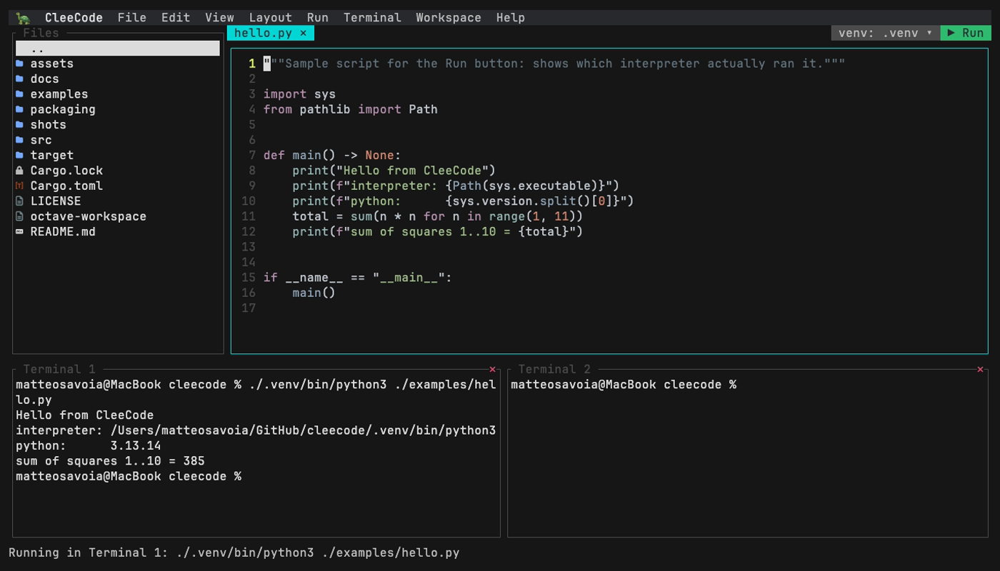
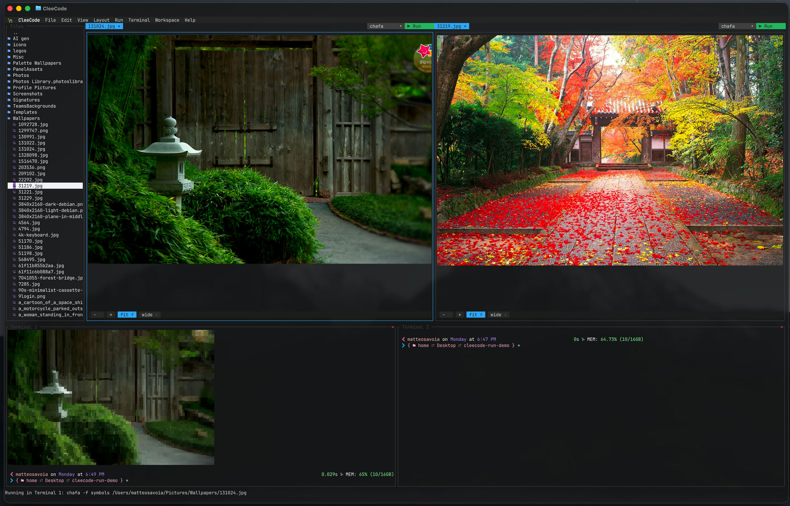
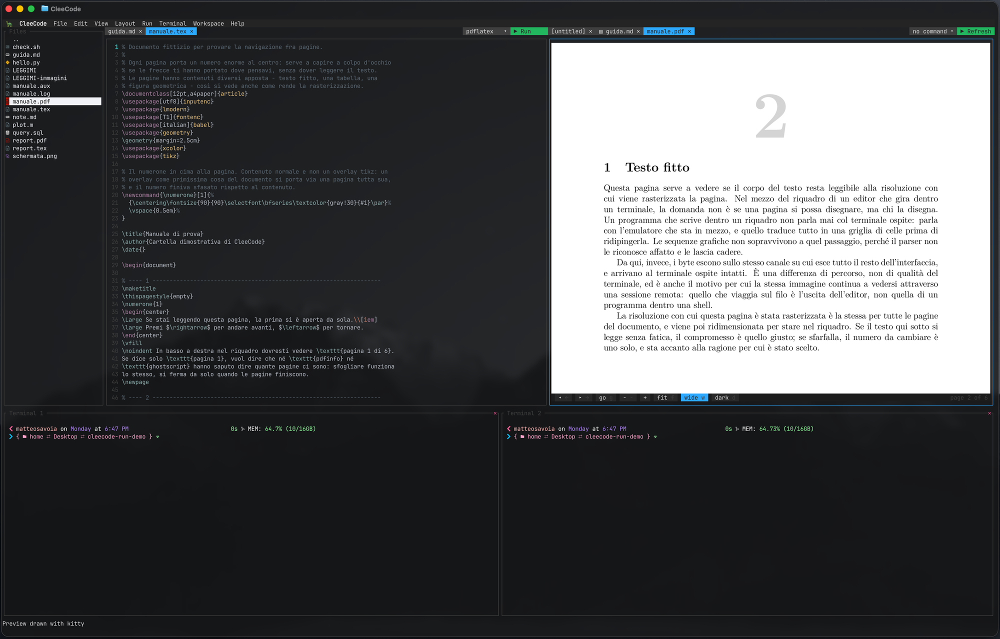
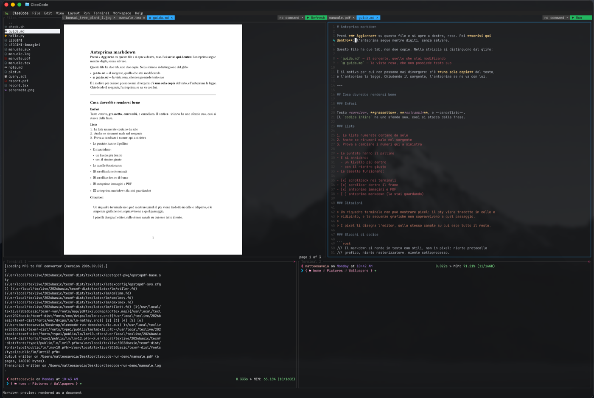
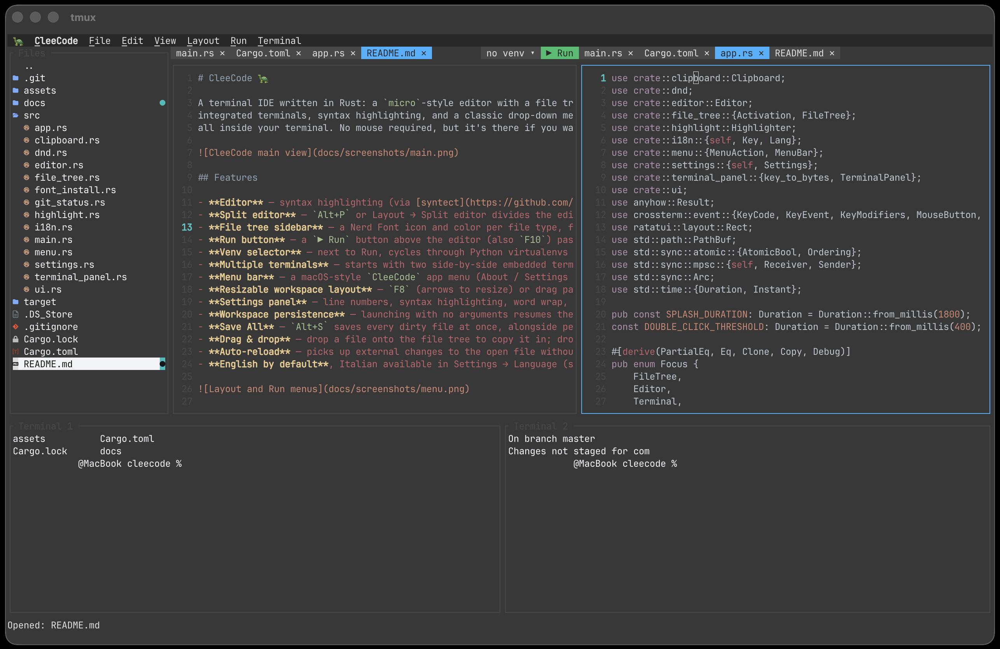
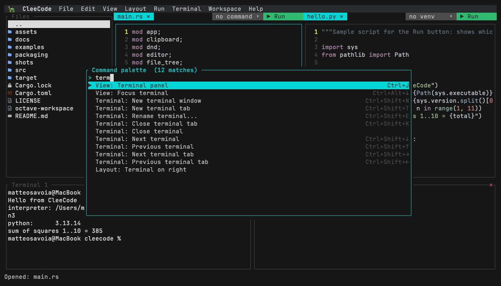
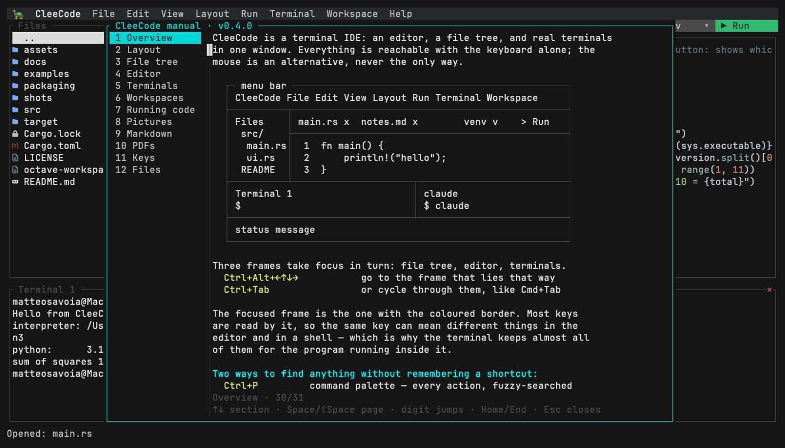
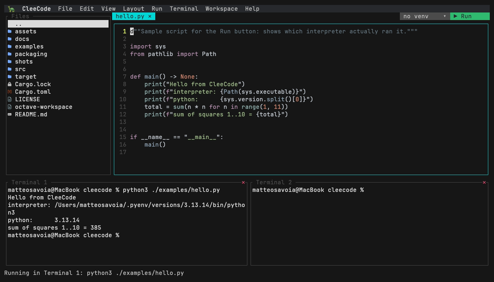
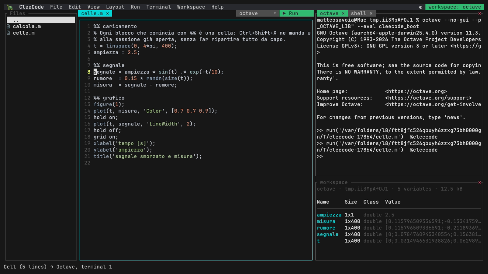
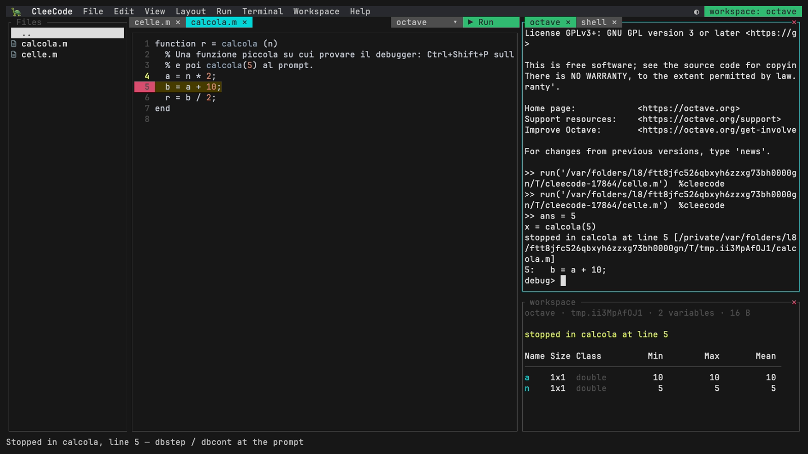

# What CleeCode does

The tour. Every key here is also in the built-in manual (`Ctrl+Shift+M`), which ships inside
the binary and so cannot fall out of step with it; this page is the version you can read
before installing anything.

Two more pages go deeper where a paragraph is not enough:

  · [The numeric side](numeric.md) — Octave and Python as an IDE
  · [How the interpreter side was built](design/ide-mode.md) — the measurements behind it




*The demo and most stills are replayed from [`docs/demo.tape`](demo.tape) and
[`docs/shots.tape`](shots.tape), so they are re-made after a UI change rather than left to
go stale. The preview shots below are taken by hand: they need a terminal that can draw
pictures, and the recorder has none.*

### Editing

[syntect](https://github.com/trishume/syntect) highlighting over
[two-face](https://github.com/CosmicHorrorDev/two-face)'s grammars — 200-odd languages, the
ones written this decade included — line numbers, multi-file tabs,
undo with coalescing, find and replace, go-to-line, code folding, auto-indent and auto-closing
brackets. Selection works with the mouse or the keyboard, goes to the system clipboard, and can
be **rectangular** — `Alt`+drag for a column selection over ragged text. A rectangle also
**writes**: with one up, a printable key puts its character on every line of the block and
`Backspace` takes one off each, and the column stays where it is for the next key, so a prefix or
a comment marker goes down twenty lines as fast as you can type it. Lines too short to reach the
column are left alone rather than padded out to it, and `Esc` drops the block.

`Ctrl+L` splits the editor into two independent editors sharing one pool of buffers: each half
has its own tabs, no file is in both strips at once, and closing the last tab of a half closes
the split rather than leaving it empty. Closing the last tab of all leaves nothing open — an
empty frame that says how to open something — rather than the untitled buffer that used to take
its place, which made that tab the one tab you could not close. Files changed underneath you are reloaded when they are
not dirty, and a binary or non-UTF-8 file opens
read-only rather than being corrupted on save.

The status bar names what a writable buffer will be saved as — UTF-8, always, since anything
else is exactly what opens read-only above — and LF or CRLF, right beside `row:col`. The Edit
menu's **Convert line endings** flips it for the next save; it is deliberately not on the undo
stack, since a checkpoint is a version of the text and the ending is not text.

Past 50 MB a file opens in a **declared large-file mode**, and the bar declares it: the size on
the way in, then the word `large` beside the encoding for as long as the file is open. Such a
buffer gets no syntax highlighting, contributes none of its own words to the completion popup
(keywords and session names still arrive, and one huge file left open in a background tab does
not tax completion in the others), and keeps twenty undo steps instead of five hundred — a step
is a copy of the whole text, so five hundred of them at this size is not a deep history but an
out-of-memory kill with your unsaved work inside it. Project search leaves a file that size out
too, open or not. It is a constant and not a setting: a knob would be a promise to behave at
every value somebody turns it to, and this is the line past which the editor would rather say
what it is not doing than do it and stop answering the keyboard.

An editor with an agent running in one of its terminal panes is being written to while you read
it, so the reload says what it did: **the lines that arrived are lit in the gutter**, their line
numbers green, until an edit of your own — or `Esc` — puts them out. A diagnostic or a breakpoint
on the same line keeps the colour, because one is information and the other you put there
yourself. **Follow mode**, off until you ask for it, takes the next step: a file something writes
that you have not opened appears beside your work without ever taking the keyboard, at most one
per sweep and five in a session. It needs no watcher and knows nothing about agents — what it
follows is the difference between two `git status` sweeps, which happen anyway, so `claude`,
`codex`, `opencode` and a `sed` in a shell all trip it identically. Outside a git repository
there is nothing to watch, and switching it on says so. Scrollbars appear inside the frame while the view
moves or the pointer rests on them, and they are working controls: drag the thumb, click the
groove to jump, click the end arrows to step a line.

Pictures, PDFs and Markdown open as themselves. A `.png` gets a tab that draws it — real pixels
on a terminal with a graphics protocol (kitty, iTerm2, sixel), coloured half-blocks elsewhere —
instead of the blank read-only buffer a binary file used to give. An animated `.gif` plays there
too, at the speed the file itself asks for and looping for as long as the tab is on screen; one
whose frames would not fit in memory shows its first frame and says why, rather than freezing to
find out. A PDF opens as pages, turned with the plain arrow keys, and re-renders in place when
the file changes: edit the `.tex`, press Run, and the page beside it is the one you just typeset.

Every preview carries a navigation bar along its bottom edge: the page arrows, `go` to jump to a
page by number, `-` and `+` for zoom, and `fit` or `wide` to size the page to the pane or to its
width. Each control is labelled with its own key, so the bar is also the reminder of how to work
without the mouse — though the wheel zooms as well, and the scrollbars drag. Documents get one
control pictures do not, `dark`, which inverts the page for reading at night: inverting a
photograph is not a reading aid, it is just a wrong photograph. The setting is remembered
between sessions.



*The same file twice: real pixels in the tab, and `chafa` putting it into a terminal pane with
the Run button beside it.*

Markdown gets a live preview beside the source — one file, two tabs, one copy of the text, so
the two can never disagree about what it says. Where `pandoc` is installed it is a real
document, pictures the text refers to included; elsewhere it falls back to styled terminal text.
CleeCode draws all of it itself, so it works over `ssh` too.



*Edit the `.tex`, press Run, and the page beside it is the one you just typeset. On a preview
tab the button says Refresh instead, because there the file is generated and can come out
different.*



*Two tabs onto one file. The glyph in the strip tells them apart, and typing in the source moves
the document beside it without a save.*

Two letters into a word, a short list drops under the cursor: the words already written in the
open files, and the language's keywords. It is not a box you have to answer — `↑↓` walk the list,
`Tab` or `Enter` take a word, `Esc` dismisses, and every other key goes on typing while the list
narrows. The nearest words come first and keywords last, because a keyword is quicker to type
than a list is to walk. Where an interpreter is open, the names *that session* is holding are
offered too, in green: a variable you made at the prompt exists in no file, so nothing that reads
one could suggest it.

Where a language server is installed it feeds the same list, in magenta — and those are the names
no amount of reading the file could have found, because after a dot they are whatever that *type*
has. The list never waits for them: it opens on the words in the file and the server's names drop
into it a moment later, without moving a row you have already arrowed down to.

The same server underlines what it finds wrong, where it is — red for an error, yellow for a
warning — the line number takes the same colour, and the message for the line you are on sits at
the right of the status bar. When the line is clean, that spot says what the thing under the
cursor **is** instead: the type, or the signature, one line of it. Nothing is pressed for it — it
arrives when the cursor stops on a word, and a diagnostic wins the space when there is one,
because an error on this line is news and a type is not.

`Ctrl+Shift+J` goes to the definition of what is under the cursor and `Ctrl+Shift+L` comes back.
A stack of them, so following a name into a name into a name still leads home.

**What can be done here** — in the **Edit** menu and on a right-click in the editor — asks the
server about the spot the cursor is on: the import it would add, the compiler's own suggestion,
the rewrite it knows how to do. The diagnostic you are sitting in travels with the question, which
is what makes the answer a fix for *that* error rather than a list about the file in general; with
a selection, the question is about the selection. The answer is a list you narrow by typing, and
picking a row carries it out: all inside one open buffer it lands as a single edit that one
`Ctrl+Z` takes back, and anything wider comes up in the rename's diff first, with the rename's
refusals — including the count of files it wants that no tab holds. Some servers name an action
and work out what it would change only once it is chosen, so a row can take a moment. On demand
only, like the rename and the format, and with no chord of its own: every `Ctrl+Shift` letter is
already spoken for.

`Ctrl+Super+↑` widens the selection to whatever encloses it — the name to the expression it sits
in, that to the statement, the statement to the function — and `Ctrl+Super+↓` walks back in again.
The server is asked once and answers with the whole ladder, so every press after the first is
instant; anything else that moves the cursor ends the walk, and the next widening starts from
where you now are. Both are in the **Edit** menu as well, beside Select all.

That modifier is the one thing in CleeCode your terminal has to be able to send: it is `Cmd` on
macOS and `Super` elsewhere, and only the kitty keyboard protocol reports it with the keypress —
Ghostty, kitty, WezTerm, iTerm2 and foot do, Terminal.app does not, and neither does a window
manager that keeps that key for itself. Where it never arrives the two menu rows do exactly the
same thing, and `[keys]` in `settings.toml` moves either onto a chord your terminal does deliver.

The same server also decides where `Ctrl+Shift+F` folds, when it has been asked: the block it
names beats the brace counting, which is how an import group or a Python body with no braces in it
becomes foldable at all. It is asked when a file opens and again when it is saved — the two moments
the buffer and the server are looking at the same text — so a buffer with unsaved changes folds by
the braces until the next save, because a line number written down before an edit is a line number
about a file that no longer exists.

It speaks LSP over stdio directly rather than through a framework, and is told about an edit once
you stop typing rather than on every key. Names are known for rust-analyzer, pyright, tsserver,
gopls, clangd, lua-language-server, zls, solargraph, bash-language-server, texlab and a couple
more; one process per program, started the first time a file it serves is open, so a project with
Rust and Python in it ends up with both and each is told only about its own files. For anything
else — a language nobody put in that list, or your own build of a server — `settings.toml` takes a
`[language_servers]` table of `extension = "command line"`, which wins over the built-in names, and
an entry set to `""` turns a built-in one off. A server that is not installed is not an error to
report: nothing is underlined, the list has the file's own words in it, and everything else carries
on.

`Ctrl+Shift+D` opens the git panel — or the **Git** menu, which opens it already on the tab you
came for, and a right-click on a changed file in the tree, which offers the same actions for that
file under a heading of their own.

**Status** is the tab you act on: every changed file with git's own two letters in front of it —
the index's and the working tree's — because `MM` is a file that was added and then changed again,
and one letter would lose half of that. `S` stages the file under the cursor, `U` takes it back
out, `A` stages everything, `C` asks for a message and commits, `E` rewrites the last commit, `Z`
puts the working tree away as a stash, `Enter` opens the file. **Changes** is the diff.
**Branches** lists them with the current one marked and how far each is from its upstream —
`Enter` moves to one and git refuses that itself if it would write over uncommitted work, `N`
makes one, `D` deletes one, `M` merges it into where you are. **Stashes** is what you have put
away: `Enter` applies, `O` pops, `D` drops.

**History** is a graph — every branch at once, in lanes, drawn with `git log --graph`'s own six
ASCII characters. That is deliberate: box-drawing and braille make a prettier picture where the
font has them and come out as boxes or half-column offsets over `ssh` to whatever console is
there, and a graph that is wrong about which line joins which is worse than no graph. `[main]` is
where you are standing, `(spike)` a branch, `<v1>` a tag. `Enter` opens the commit in full — its
message, what it touched and the patch; `B` starts a branch at it, `T` tags it, `K` copies it onto
your branch, `V` undoes it in a new commit, `H` moves the branch back to it.

Unlike `git log --graph`, lanes never shuffle left: a lane that empties stays empty until
something reuses it. That costs a column or two and buys lines that stay in their column, so the
only diagonals left are the two that mean something — a branch leaving and a branch coming back.

`Q` gets out of a merge, a pick, a revert or a rebase that stopped part-way, and is offered only
while there is one to get out of.

`F`, `L` and `P` — fetch, pull and push — are typed into one of your shells rather than run behind
the panel, and that is the point rather than a shortcut: they can stop to ask for a passphrase, a
two-factor code or a host key, and a modal panel has nowhere to put such a question. A terminal is
exactly the thing that can ask it. The panel closes and the shell takes the focus.

`X` throws away every change to a file, and it is the only thing in CleeCode that destroys work:
what it removes is in no commit and no stash. So it asks first, and the question takes one letter
and reads every other key as no — including the ones that do something to the list behind it. A
file git has never been told about is refused rather than deleted; there is nothing to put back,
and `rm` belongs in the terminal where it reads as what it is.

`X` and the other questions that cannot be taken back are drawn in red only where saying yes
destroys something that is in no commit, no stash and no reflog — throwing a file's changes away,
`reset --hard`, dropping a stash. Deleting a branch asks in the same shape and not in the same
colour, because its commits stay in the reflog for ninety days and red on every question is red on
none of them.

Everything goes through `git` on PATH rather than a library, so what the panel does is what the
terminal beside it would do: hooks run, commits are signed, credential helpers are asked. The
spellings are the old ones — `reset HEAD --`, `checkout HEAD --`, `stash save` — because a
long-lived server reached over `ssh` is exactly where a terminal editor earns its keep, and it is
also where the newer commands are missing.

For a one-off edit there is `clee -e FILE`: the editor and nothing else, leaving your saved
layout and session untouched.



### Terminals that are real

Each terminal window is a tiled pane holding one or more tabbed shells, on proper ptys — `ssh`,
`vim`, `claude` all work. Panes can be renamed, given a startup command, resized by dragging the
seam, and they collapse when their shell exits.

The keys respect that: a focused terminal keeps every `Ctrl` chord for the program running in it.
`Ctrl+J` is Enter to a shell, `Ctrl+E` is end-of-line, and the editor does not steal either.

Each shell keeps its scrolled-off output. The wheel walks back through it, typing returns to the
live end, and output arriving while you read back does not drag the page away. The same
scrollbar the editor has shows where in the history you are.

`▶ Run` runs the current file in an idle terminal. The button beside it says what Run will use
on *this* file and changes it: the venv selector on a `.py` file, and on any file type the run
command for its extension — `{file}`, `{dir}`, `{name}` and `{stem}` to build it, so a `.tex`
file can typeset and open its own PDF, and `chafa` will put a `.png` in a terminal pane beside
its output. A command can be shared by every project or kept in the project's own `.cleecode.toml`,
which wins and is meant to be committed with it. Interpreters off `PATH` go under
`[interpreter_paths]`.

### Agents, over MCP

Claude Code, codex, opencode and gemini are terminal programs, and CleeCode hosts real terminals —
so an agent already runs in a pane beside the file it is working on, with nothing to install. What
an integration adds is the other direction: telling the agent what only the editor knows.

`clee --mcp` is that. CleeCode becomes an MCP server on stdin and stdout, spawned by the agent
itself: one implementation, four consumers. It works by descent — every shell CleeCode starts
carries `CLEE_SESSION`, the directory this editor publishes into, so an agent launched in a pane
inherits it and the `clee --mcp` it spawns inherits it in turn. Neither end searches for the
other, which is what stops two open CleeCodes being mistaken for each other; an agent started
anywhere else gets a tool that says so rather than a wrong answer.

Seven tools. Four read: `open_files` (the files open in tabs, which is active, and which have
unsaved changes), `selection` (the active file, the cursor's line and column, and the selected
text) and `diagnostics` (what the language server currently says, whole or for one file). Three
make the editor move: `open_file` (show a file, optionally at a line, optionally highlighting a
range of them), `preview` (render a file in the preview pane — markdown as a document, images and
PDFs as pictures) and `say` (one line in the status bar, marked as the agent's). All three open
**beside** your work and none takes the keyboard, the same rule the Octave and Python figures
follow; a highlighted range is an ordinary selection, and it goes the moment you touch that pane.

The seventh writes. `edit_buffer` changes text in a buffer that has **unsaved** changes in it —
the ones `open_files` lists as dirty, where an agent cannot simply edit the file because your work
is in the buffer and nowhere else. It asks first, on the status line: `Y` once, `A` for the whole
session, `N` or Esc to refuse, and the agent's call waits up to two minutes for the answer. The
change lands in the buffer as one step of undo and is *not* saved — the file on disk stays yours
to write. The settings panel decides whether it asks at all, and `agent_edits = "ask"` /
`"allow"` / `"deny"` in `settings.toml` is the same switch. Clean files need none of this: an
agent edits those on disk as it edits anything, and CleeCode reloads the tab by itself.

**An agent started from the drawer needs no configuration at all.** `Ctrl+Shift+A`, Enter, and it
comes up with `clee --mcp` already registered — by whichever mechanism that agent has: claude is
handed `--mcp-config`, codex two `-c` overrides on its command line, opencode `$OPENCODE_CONFIG`
and gemini `$GEMINI_CLI_SYSTEM_SETTINGS_PATH`. The files those name are written into the session
directory, which goes when this CleeCode does, and the binary they name is the CleeCode that is
running — so a development build registers itself rather than whatever `clee` is on the `PATH`.
Nothing is ever written into `~/.claude.json`, `~/.codex/`, `~/.config/opencode/` or `~/.gemini/`:
each of the four *merges* what CleeCode passes with the servers you registered yourself, and your
own model, provider and keys are exactly where you left them.

The two that take it on the command line are asked first whether they understand the flag — their
own `--help` is read for it — and one whose version does not is started bare instead. The drawer
`exec`s the agent, so a rejected flag would be a usage message and a pane that vanished. Set
`agent_mcp = false` in `settings.toml` if you would rather the drawer start the agent exactly as
you would yourself.

An agent you start anywhere else — a terminal pane, another window, another editor — is your
program run your way, and CleeCode leaves it alone. It still reaches this session by descent, and
one line of configuration is what gives it the tools. Claude Code:

```
claude mcp add clee -- clee --mcp
```

codex, in `~/.codex/config.toml`:

```toml
[mcp_servers.clee]
command = "clee"
args = ["--mcp"]
```

opencode, in `~/.config/opencode/opencode.json`:

```json
{ "mcp": { "clee": { "type": "local", "command": ["clee", "--mcp"], "enabled": true } } }
```

gemini, in `~/.gemini/settings.json`:

```json
{ "mcpServers": { "clee": { "command": "clee", "args": ["--mcp"] } } }
```

All four are the shapes CleeCode now writes for itself in the drawer, checked against the running
CLIs rather than taken from documentation. What no check can cover is a version that has moved on
— which is why the drawer asks before it passes a flag, and why these four lines are here to fall
back on if it ever stops.

### Workspaces

Save a whole set-up under a name: project root, open files, frame sizes, and the terminal windows
with their tab names and startup commands. Reopening one brings the shells back already running
`claude`, `octave`, `npm run dev`. Open it from the Workspace menu or straight from the shell
with `clee -w NAME`; the name it is running under sits in the corner of the menu bar.

Each is one hand-editable TOML file under `~/.config/cleecode/workspaces/`, so they travel
between machines. Four built-ins are always there and cannot be deleted or overwritten:
**Default layout** puts the frames back to CleeCode's own shape; `octave` and `pylab` open the
interpreter you already have, prompt and workspace panel arranged for that kind of work; and
`minimal` strips the frames away entirely — no sidebar, no terminal, no menu bar, just the editor.
A bare `clee` never reopens a named workspace — that stays a deliberate act — but it does restore
the project, its open files and the layout you left.

### The agent drawer

`Ctrl+Shift+A` summons it: a panel down the right of the window, in whatever workspace you are
already in. Empty, it is the launcher — claude, codex, opencode and gemini written large, arrows
and Enter to start one, the last one you used already highlighted. An agent that is not on your
`PATH` is listed anyway, dimmed and with the reason beside it, because the empty drawer is also
where you find out what CleeCode knows how to run.

It has two modes, from *Settings → Agent drawer*. **Pinned**, the default, makes it a column of
the layout: every other frame makes room, and it stays until you put it away. **Autocollapse**
paints it over the frames instead and withdraws it the moment the keyboard goes back to your
work — the signal is the focus, not a pointer passing over — and the same key brings it back.
The difference is not decoration: a column resizes every pane, and a resized pane is a `SIGWINCH`
to the pty in it, so a question asked in passing costs nothing on the way out or back.

Putting the drawer away is not killing it. The agent goes on running, the conversation is exactly
where you left it, and it survives opening another workspace — which rebuilds every terminal in
the window and never touches the drawer. When the agent itself ends, the launcher comes back:
never a shell wearing the agent's frame.

There is nothing to install and nothing to configure, because this is a real pty and all four are
terminal programs. Subscription login and API keys both work, and for the same reason: the agent
authenticates itself, with the login or the key it finds in your environment — CleeCode never
asks for, stores, or sees a credential of any kind.

With an agent running — in the drawer, or in any terminal pane — that same `Ctrl+Shift+A` hands
it whatever you are looking at: the selection, or the diagnostic under the cursor, or the line the
cursor is on, written at its prompt as `path:line` with the text of a short selection under it.
The drawer is asked first, and a collapsed one is reopened before the text arrives, because text
sent to a prompt nobody can see is worse than no text at all. And then it stops. **Nothing is
ever submitted**: no newline is sent, the text sits at the prompt, and Enter is yours to press
once you have read what you are about to ask. The way back was already there — an agent prints
`file:line` all day, and double-clicking one opens the file at that line.

### Finding your way

Nothing needs to be memorised. `Ctrl+P` fuzzy-searches every action in the app and shows the key
that would have done it; `Ctrl+O` does the same for files, and a query starting `/`, `~`, `./` or
`../` turns it into a filesystem browser.



There is a full menu bar behind `Ctrl+Shift+B`, context menus on right-click, and a manual that
travels with the binary — `Ctrl+Shift+M`, English or Italian, with diagrams.



There is also a `man clee`.

### The frame around it

A file tree with per-type Nerd Font icons and git status dots, live refresh, create/rename/delete
and drag & drop (dropped onto a terminal inside an `ssh` session, files go up with `scp`).
Three layout presets, a resizable everything, and a settings panel that applies changes live.
English and Italian throughout, including the manual. CleeCode paints its own background: a theme
is a set of colours and the surface they were chosen against, and it arrives with both. The `●`
at the right-hand end of the menu bar hands that surface back — it becomes a `◐`, and a
translucent terminal shows your desktop through the editor again. The next theme you choose takes
it back, which is the point: a theme picked because the screen had become unreadable arrives
whole.



### Octave and Python, as an IDE

`clee -w octave` or `clee -w pylab` starts the interpreter you already have — in a terminal you
can type into — and puts a second window beside it showing what that session holds: every
variable with its size, class and range, filling in by itself whenever a command finishes.



Nothing CleeCode wants to know is typed at your prompt. Your transcript stays a record of what
*you* did, and a busy interpreter is never interrupted mid-computation to answer a question about
itself. `Ctrl+Shift+X` sends a cell to the running session, plots arrive as tabs beside the script
that drew them, `Ctrl+Shift+I` looks inside a variable, and `Ctrl+Shift+P` sets a breakpoint —
where the panel shows the *frame's* variables rather than the session's.



Everything works in both languages and almost none of it works the same way underneath.
**[The full walkthrough is its own page](numeric.md)**, including what is different between the
two and what is not built yet.

### Debugging a compiled program

The same breakpoints work on C, C++ and Rust. **Debug ▸ Start debugging** asks which program to
run, with the guess already in the box — for a Cargo project, `target/debug/<package>`, read out
of `Cargo.toml` — so accepting it is one keystroke and correcting it is typing. It runs under
whichever debug adapter the machine has — `lldb-dap`, or a `gdb` 14 or newer, which speaks DAP
natively — and where there is neither, one status line names what to install for your platform.
The answer is remembered in the workspace file, and `debug_adapter` in `settings.toml` points at
an adapter of your own.

There is one set of breakpoints: `Ctrl+Shift+P` in any file, told to whichever debugger is
running, including the moment you take the last one off a file. Stopping moves the editor to the
line and marks it without taking the keyboard, exactly as the interpreter debugger does. Continue,
step over, step into and step out are rows in the Debug menu and entries in the palette — no new
chords, because a debugger you could not step over `ssh` in Terminal.app would not be worth the
key it was bound to.

A panel opens beside the editor with the session and closes with it: the stack at the top with the
current frame marked, the frame's variables under it opened one level, your watch expressions
under those, and the tail of whatever the program has printed along the bottom. The arrows walk
it; `Enter` on a frame shows that frame's line — beside what you were reading, without taking the
keyboard — and reads the variables there; `Enter` on anything with a `▸` opens it. While the panel
has the focus, single letters do the work the way `gdb` spells them: `c` continue, `n` step over,
`s` step into, `o` step out, `w` add a watch, `d` drop the one under the cursor, `x` stop. They
only ever reach the panel, so nothing you type anywhere else changes meaning.

### It does not close on you

CleeCode hosts long-running shells, so a crash costing you an `ssh` session or a build would be
the worst thing it could do. An internal failure is contained and reported in the status line
rather than ending the process: a broken terminal costs you that terminal, at most. Details go to
`~/.config/cleecode/panic.log`.

## Key bindings


| Key | Action |
|---|---|
| `Ctrl+Alt+←` `↑` `↓` `→` | Go to the frame that lies in that direction — sidebar, either half of a split editor, or a tiled terminal, whichever is there. `Ctrl+Alt` rather than plain `Ctrl` because macOS keeps `Ctrl`+arrow for Mission Control and Spaces |
| `Ctrl+Tab` / `Ctrl+Shift+Tab` | Or cycle the frames, the way `Cmd+Tab` cycles windows |
| `Ctrl+Shift+←` / `→` | Previous / next tab *inside* the focused frame |
| `Ctrl+Shift+↑` / `↓` | Previous / next terminal window, whatever the layout |
| `Ctrl+Shift+M` | The built-in manual |
| `Ctrl+Shift+B` | Open the menu bar (then arrows and Enter) |
| `Ctrl+Shift+O` | Settings |
| `Ctrl+Shift+G` / right-click | Context menu for the focused frame |
| `Ctrl+Shift+R` | Run the current file |
| `Ctrl+Shift+T` / `Ctrl+Shift+K` | New terminal tab / close this shell |
| `Ctrl+Shift+N` | New terminal window |
| `Ctrl+Shift+U` | Resize mode (arrows grow the focused frame, `Shift`+arrow shrinks) |
| `Ctrl+Shift+F` | Fold/unfold the block under the cursor |
| `Ctrl+Shift+Y` | Everywhere the name under the cursor is used, as a filterable list |
| `Ctrl+Shift+V` | The symbols of this file, in document order — Enter jumps to one |
| `Ctrl+Shift+C` | Rename the symbol under the cursor: a diff-shaped preview first, one undo step per file |
| `Ctrl+Super+↑` / `↓` | Widen / narrow the selection by the language's own structure (`Cmd` on macOS; needs a terminal that reports that key — see above) |
| `Ctrl+L` | Toggle split editor (`Ctrl+Alt+←`/`→` moves between the panes) |
| `Ctrl+S` / `Ctrl+Shift+S` | Save / save all (an unnamed buffer asks for a name; Save As is in the File menu) |
| `Ctrl+Shift+A` | Send where you are — selection, diagnostic, or cursor line — to the prompt of an agent running in one of the terminals. Nothing is submitted: Enter is yours |
| `Ctrl+Shift+W` | Save the current workspace (open and delete are in the View menu) |
| `Ctrl+Shift+E` | Name the focused terminal and give it a startup command |
| `Ctrl+E` / `Ctrl+J` | Toggle sidebar / terminal panel |
| `Ctrl+B` | Show/hide the menu bar |
| `Ctrl+W` / `Ctrl+D` | Close current tab (prompts if unsaved) |
| `Ctrl+Q` | Quit (prompts if any file is unsaved) |
| `Ctrl+C/X/V/A` | Copy / cut / paste / select all (in the editor) |
| `Ctrl+Z` / `Ctrl+Y` | Undo / redo (`Ctrl+Shift+Z` also redoes) |
| `Alt+Left` / `Alt+Right` | Move by word (`Ctrl`+arrow too, where the OS allows it) |
| `Ctrl+Backspace` / `Ctrl+Delete` | Delete the word before / after the cursor |
| `Ctrl+P` / `Ctrl+O` | Command palette / quick open (both fuzzy) |
| `Ctrl+F` / `Ctrl+G` | Find and replace / go to line |
| `Ctrl+U` / `Ctrl+N` | Inside Find: case sensitivity / read the query as a regex |
| `Ctrl+Shift+H` | Search the project; results are a list, `Enter` opens one at its line |
| `Tab` in that box | A second field: what the matches become. Empty, `Enter` is the search above; filled, `Enter` shows a diff of every file it would change and writes nothing until you agree — open buffers take one `Ctrl+Z` each, files with no tab are rewritten on disk (no undo, so the count is said out loud) |
| `Ctrl+Shift+D` | Git panel: status, changes, history, branches — stage, commit, switch, straight from `git` |
| `Ctrl+K` | Toggle line comment |
| `Alt+Up` / `Alt+Down` | Move the current line up / down |
| `Alt+Shift+Down` | Duplicate the current line |
| `Tab` / `Shift+Tab` | Indent / outdent |
| `Alt`+drag | Column selection (also in the Edit menu, then `Shift`+arrows). Typing writes on every line of the block, `Backspace` deletes on every line, `Esc` drops it |


In the file tree: `↑↓` move, `→` expand, `←` collapse or jump to parent, `Enter` / double-click
opens a file or reroots a folder (`..` walks up), `n` / `N` create a file / folder, `e` renames,
`Delete` removes with confirmation, `H` toggles hidden files.

There are deliberately **no function keys and no `PageUp`/`PageDown`** — on a laptop both need
`Fn` — and **no `Alt`+letter chords**, because macOS only sends Option as Meta on US keyboard
layouts, so on any other one they never arrived at all. `Ctrl+Shift` is the application's layer,
and it is safe inside a terminal for a structural reason: no terminal can encode `Ctrl+Shift` for
the program running in a pane, so nothing there is listening for it.

The same list, with more detail, is in the built-in manual (`Ctrl+Shift+M`) and in `man clee`.

### Moving a chord

Those reasons hold for an Italian layout on a Mac and are somebody else's arbitrary rules. Every
chord in the `Ctrl+Shift` layer can be moved, one at a time, by a `[keys]` table in
`settings.toml`:

```toml
[keys]
find-in-project = "Ctrl+Alt+F"
manual          = "F1"
```

Anything not named there keeps the key it shipped with — this is not a keymap language, it is the
ability to move a chord that your keyboard does not have. A chord is modifiers and a key joined
with `+`: `ctrl`, `shift` and `alt` in any case or order, and then a letter, a digit, `F1` to
`F12`, an arrow (`left`/`right`/`up`/`down`, or `←→↑↓`), `enter`, `tab`, `esc` or `space`.

**CleeCode ▸ Keybindings...** writes the whole table into `settings.toml` as comments — every
action, on the key it is on now — and opens the file: uncomment the line you want, change its
chord, save. The new chords take effect on that save. A name or a chord CleeCode cannot read is a
sentence on the status line and a default left where it was, never a file that fails to load; two
actions on one chord is also reported, and the one listed first in the file wins.

The manual and the menus then advertise the chord you chose rather than the one we shipped.
