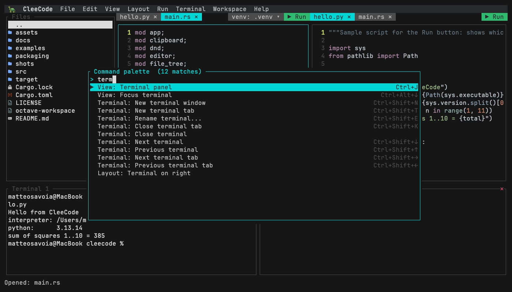

# Anteprima markdown

Premi **▶ Aggiorna** su questo file e si apre a destra, reso. Poi **scrivi qui
dentro**: l'anteprima segue mentre digiti, senza salvare.

Questo file ha due tab, non due copie. Nella striscia si distinguono dal glifo:

- `guida.md` — il sorgente, quello che stai modificando
- `▤ guida.md` — la vista resa, che non possiede testo suo

È il motivo per cui non possono mai divergere: c'è **una sola copia** del testo,
e l'anteprima la legge. Chiudendo il sorgente, l'anteprima se ne va con lui.

---

## Cosa dovrebbe rendersi bene

### Enfasi

Testo *corsivo*, **grassetto**, ***entrambi***, e ~~cancellato~~.
Il `codice inline` ha uno sfondo suo, così si stacca dalla frase.

### Liste

1. Le liste numerate contano da sole
2. Anche se rinumeri male nel sorgente
3. Prova a cambiare i numeri qui a sinistra

- Le puntate hanno il pallino
- E si annidano:
  - un livello più dentro
  - con il rientro giusto
- Le caselle funzionano:

- [x] scrollback nei terminali
- [x] scrollbar dentro il frame
- [x] anteprime immagini e PDF
- [ ] anteprima markdown (la stai guardando)

### Citazioni

> Un riquadro terminale non può mostrare pixel: il pty viene tradotto in celle e
> ridipinto, e le sequenze grafiche non sopravvivono a quel passaggio.
>
> I pixel li disegna l'editor, sullo stesso canale su cui esce tutto il resto.

### Blocchi di codice

```rust
/// Il markdown si rende in testo con stili, non in pixel: niente protocollo
/// grafico, niente rasterizzatore, niente sottoprocesso.
pub fn render_markdown(source: &str) -> Vec<Line<'static>> {
    // ...
}
```

```toml
[run_commands]
tex = "pdflatex -interaction=nonstopmode -output-directory {dir} {file}"
png = "chafa -f symbols {file}"
```

### Immagini nel flusso

È il motivo per cui l'anteprima passa da un documento vero invece di disegnare
celle colorate: un'immagine in mezzo al testo, una griglia di caratteri non la
sa mettere.



E il testo riprende sotto, come in qualsiasi documento.

### Collegamenti

Un [collegamento](https://github.com/msavox/cleecode) è sottolineato e blu.

---

## Da provare davvero

1. **Scrivi mentre guardi.** Aggiungi una riga qui sotto e vedila comparire a
   destra senza premere niente.
2. **Rompi il markdown apposta.** Togli la chiusura di un blocco di codice: deve
   rendersi comunque, in modo strano ma senza cadere.
3. **Scorri l'anteprima.** Rotellina o frecce sul riquadro reso; il sorgente
   dall'altra parte non si muove.
4. **Chiudi il sorgente.** L'anteprima deve sparire con lui, invece di restare
   lì a mostrare un file che non hai più aperto.
5. **Premi ▶ sul tab reso.** Il pulsante lì dice *Aggiorna*, non *Esegui*.

Scrivi qui sotto e guarda a destra:
